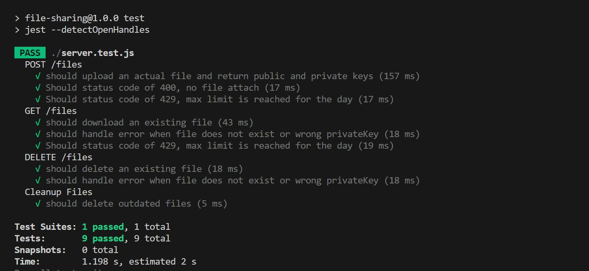

### Navigate to the project folder

```bash
cd projectfolder
```

### Install dependencies:

```bash
npm install
```

Configuration
Create a .env file in the root of your project and add the following environment variables

```bash
PORT=3000
FOLDER=/path/to/your/root/uploads-folder
```

Adjust the values based on your project's requirements.

### Usage

Starting the API Server

```bash
npm start
```

This will start the API server using the configuration provided in the .env file.

Open browser and type http://localhost:3000/ or click link below\
[Filesharing](http://localhost:3000/)

### Running Tests

```bash
npm test
```

Should return \


This will run both unit and integration tests.

API Endpoints
POST /files
This endpoint is used to upload new files. It accepts multipart/form-data requests and returns a response in JSON format with the attributes: publicKey and privateKey.

GET /files/:publicKey
This endpoint is used to download existing files. It accepts publicKey as a request parameter and returns a response stream with a MIME type representing the actual file format.

DELETE /files/:privateKey
This endpoint is used to remove existing files. It accepts privateKey as a request parameter and returns a response in JSON format confirming the file removal.

File Access Functionality
All file access functionality is implemented in the FileHandler component.

Additional Features
Configurable Daily Download and Upload Limits
The API Server implements configurable daily download and upload limits for network traffic from the same IP address.

Automatic Cleanup
The API Server has an internal job to clean up uploaded files after a configurable period of inactivity.
